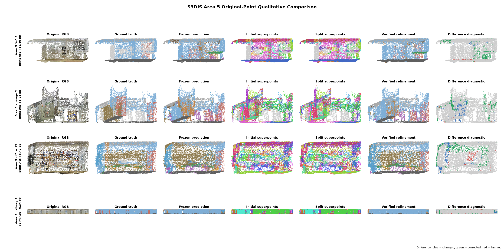

# Dataset-Specific Four-Stage Experiments

## Correction

The target method is the S3DIS configuration that reaches 45.84 mIoU, not the
later learnable-superpoint checkpoint that starts at 44.39 mIoU. The exact
S3DIS checkpoint chain is:

- frozen backbone and classifier: `ckpt/S3DIS/baseline/ckpts`, epoch 1270;
- historical references: epochs 1170, 1180, and 1190 from the same run;
- Error-Query Refiner: `ckpt/S3DIS/refiner_projectloss02_e10/refiner_best_checkpoint.pth`;
- fixed Meta/Verifier configuration: temporal PoE weight 0.08 and confidence
  threshold 0.80;
- online episodic Meta: class-wise support/query adaptation followed by the
  temporal override verifier.

The evaluator now checks the SHA-256 binding between every dataset-specific
Refiner and its frozen backbone. A mismatched checkpoint terminates evaluation.
There is no zero-residual Refiner fallback in these results.

The ScanNet result reported in the previous revision is withdrawn. Native
`eval_ScanNet.py` reproduces only 3.54 mIoU from the supplied local epoch-930
checkpoint, while the GrowSP paper reports 25.4 +/- 2.3. The local training log
also records only 3.58--4.56 mIoU at epochs 30--100 and stops at epoch 108.
This is an invalid or incomplete local run, not an official GrowSP baseline.

## Checkpoint Protocol

| Experiment | Frozen checkpoint | References | Refiner checkpoint |
| --- | --- | --- | --- |
| S3DIS / GrowSP | `S3DIS/baseline/ckpts`, 1270 | 1170/1180/1190 | `S3DIS/refiner_projectloss02_e10/refiner_best_checkpoint.pth` |
| ScanNet / GrowSP | invalid local run; withdrawn | - | - |
| SemanticKITTI / GrowSP | `SemanticKITTI/baseline/ckpts`, 400 | 370/380/390 | `SemanticKITTI/four_stage_refiner/refiner_final_checkpoint.pth` |
| S3DIS / LogoSP | LogoSP `S3DIS/seg`, 20 | 10 | `LogoSP/S3DIS/four_stage_refiner_e20/refiner_final_checkpoint.pth` |

SemanticKITTI and LogoSP Refiners are trained separately with frozen
features, current predictions, historical-checkpoint consistency, and
superpoint structure. Their optimizers do not read ground-truth labels.
Verifier and episodic Meta decisions are also label-free. Ground truth is read
only after prediction for Hungarian matching, metrics, and qualitative error
diagnosis.

The episodic Meta stage in the 45.84 protocol performs scene-local support/query
optimization and has no learned network checkpoint; the verifier is likewise
parameter-free. “Dataset-specific checkpoint” therefore applies to every
learned component: backbone, classifier, historical references, and Refiner.

## Quantitative Results

| Dataset / backbone | Scope | Frozen | Split | Refiner | Fixed Meta | Online Meta | Selected final |
| --- | --- | ---: | ---: | ---: | ---: | ---: | ---: |
| S3DIS / GrowSP | Area 5, 68 scenes | 43.8588 | 44.6369 | 45.1113 | **45.8402** | 45.8381 | **45.8381** |
| ScanNet / GrowSP | validation | invalid local checkpoint | - | - | - | - | withdrawn |
| SemanticKITTI / GrowSP | sequence 08, stride 40, 102 frames | **14.1501** | 13.7745 | 10.5878 | 12.5907 | 12.5709 | **14.1501** (rollback) |
| S3DIS / LogoSP | Area 5, 68 scenes | 45.9827 | 46.7690 | 46.3475 | 46.7272 | 46.6315 | **45.9827** (anchor rollback) |

The exact S3DIS 45.84 result is reproduced. Relative to the frozen checkpoint,
split contributes +0.7782 mIoU, the trained Refiner reaches +1.2526, and fixed
Meta/Verifier reaches +1.9814. Online episodic adaptation reaches 45.8381 and
is effectively tied with the fixed 45.8402 configuration.

LogoSP's native evaluator shows that epoch 20 is the best supplied local
checkpoint at 45.98 mIoU; epoch 100 has regressed to 43.77. The original
Refiner evaluation incorrectly applied a sparsely supervised residual to every
point in the scene. Restricting that residual to Semantic Difference candidate
points changes the same checkpoint from 45.7854 (-0.1973) to 46.3475
(+0.3649). Fixed Meta reaches 46.7272 (+0.7445), online episodic Meta reaches
46.6315 (+0.6489), and the conservative residual verifier reaches 46.7749
(+0.7922). A separate one-reference temporal-target retraining run is weaker
(45.9566 raw, 46.7430 verified), confirming that one historical checkpoint is
not a sufficiently reliable training consensus. The original Refiner weights
with candidate-support gating are retained. The generic cross-dataset anchor
selector still rolls back to the frozen result because epoch 10 fails its
reliability test; 46.7749 is therefore reported as the Verifier ablation rather
than relabeled as the automatically selected final output.

SemanticKITTI is a negative transfer result. Its Refiner and temporal anchors
are unreliable under the indoor-scene thresholds. Because none of the
historical checkpoints passes the label-free anchor test, the corrected
Verifier keeps the frozen prediction instead of applying the harmful proposal.
The result therefore remains 14.1501 rather than reporting the raw 10.5878
Refiner output as the final method.

## Efficiency

| Dataset / backbone | Scenes | Seconds / scene | Peak allocated memory |
| --- | ---: | ---: | ---: |
| S3DIS / GrowSP | 68 | 1.75 | 1848 MB |
| SemanticKITTI / GrowSP | 102 | 12.70 | 620 MB |

ScanNet efficiency is withdrawn with its invalid checkpoint. The corrected
LogoSP run takes 2.00 seconds per scene and peaks at 2232 MB on an uncontended
RTX 3090 Ti.

Timing includes the frozen backbone, historical references, superpoint
decomposition, Refiner, episodic adaptation, and verification. The S3DIS
Refiner has 286,756 parameters, SemanticKITTI has 289,465, and the
384-dimensional LogoSP Refiner has 418,852.
The verifier has no trainable parameters.

## Qualitative Results

The corrected S3DIS visualization is generated from the same 45.84 checkpoint
chain and mapped back to the original point clouds. It contains original RGB,
ground truth, frozen prediction, initial superpoints, split superpoints,
verified refinement, and a difference diagnostic. Blue denotes changed points,
green corrected points, and red harmed points.

The four selected room types are WC, storage, office, and hallway. Their
point-accuracy gains are +11.46, +6.91, +6.49, and +6.34 percentage points.
Each panel is also exported as a full-resolution PLY.



## Reproduction

The S3DIS target result is reproduced with:

```bash
env CUDA_VISIBLE_DEVICES=1 conda run -n cm_growsp python tools_eval_error_verifier.py \
  --dataset s3dis \
  --checkpoint_dir ckpt/S3DIS/baseline/ckpts \
  --base_epoch 1270 \
  --reference_epochs 1170,1180,1190 \
  --thresholds 0.80 \
  --selection_threshold 0.80 \
  --refiner_checkpoint ckpt/S3DIS/refiner_projectloss02_e10/refiner_best_checkpoint.pth \
  --meta_optimize \
  --meta_classwise \
  --meta_initial_weight 0.08 \
  --meta_keep_weight 5.0 \
  --output_json ckpt/cross_dataset/corrected_s3dis_area5_45_84_final.json
```

Dataset-specific Refiners are trained with `train_refiner_cross_dataset.py`.
The complete commands and resolved hashes are stored in each
`training_metadata.json` and final experiment JSON.
