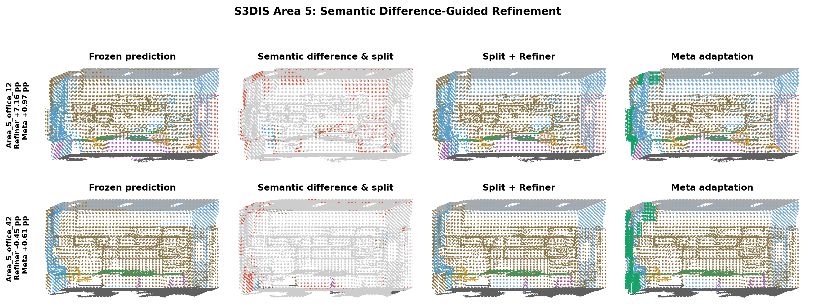
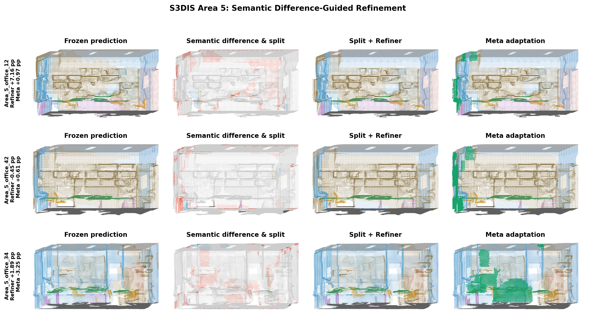

# Efficiency and Qualitative Analysis

## Protocol

All measurements use S3DIS Area 5 on one NVIDIA RTX 3090 Ti (GPU 1), base epoch 1270, historical epochs 1170/1180/1190, and the conservative Meta-Refiner configuration. Model loading and dataloader/disk I/O are excluded. Every measured stage is surrounded by CUDA synchronization.

The first three scenes are warmup. The reported statistics cover the remaining 65 scenes, with an average of 51,339 voxel points per scene. Historical predictions are computed online with three frozen reference checkpoints.

## Parameter Count

| Component | Parameters | Note |
|---|---:|---|
| Pre-trained backbone | 8.553M | Frozen reference |
| Semantic Difference-Query Refiner | 0.286756M | Added trainable network |
| Episodic adapter | 14 | Two branch gates and 12 class biases |
| Semantic Difference Verifier | 0 | Rule-based |
| Total additional trainable parameters | **0.286770M** | **3.35%** of backbone |

The three online historical references contain another 25.659M frozen parameters. They are not additional trainable parameters, but their time and memory are included in the end-to-end profile.

Relative to Split + Refiner, Episodic Meta Adaptation itself adds only 14 scene-adapted scalars.

## Runtime

| Stage | Mean | Median | P90 |
|---|---:|---:|---:|
| Pre-trained backbone | 24.25 ms | 22.82 ms | 30.10 ms |
| Online temporal evidence | 70.90 ms | 66.34 ms | 86.82 ms |
| Superpoint split + Refiner | 452.79 ms | 436.29 ms | 623.19 ms |
| Meta adaptation, all scenes | 368.06 ms | 10.71 ms | 1243.37 ms |
| Semantic Difference Verifier | 0.61 ms | 0.55 ms | 0.79 ms |
| End-to-end without Meta adaptation | 598.23 ms | 572.89 ms | 824.03 ms |
| End-to-end pipeline | **966.29 ms** | **616.03 ms** | **1903.36 ms** |

Meta adaptation is conditionally executed. It finds valid support and query corrections in 30.77% of profiled scenes. For these active episodes, its mean, median, and P90 times are 1172.66 ms, 1129.58 ms, and 1579.15 ms. Other scenes quickly return the original Refiner result. The final adapted state is accepted in 18.46% of all profiled scenes.

## GPU Memory

| Measurement | Memory |
|---|---:|
| Resident model tensors after loading | 131.82 MiB |
| Maximum peak allocated | **1668.68 MiB** |
| Maximum incremental allocated over resident models | 1536.86 MiB |
| Maximum peak reserved | **2176.00 MiB** |

These values are PyTorch CUDA allocator measurements and exclude the CUDA context and display-driver allocations that may appear in `nvidia-smi`.

## Qualitative Results

The qualitative comparison contains four columns:

1. frozen backbone prediction;
2. detected semantic-difference regions and split regions;
3. split plus Error-Query Refiner prediction;
4. Meta-adapted prediction.

Non-suspicious points are gray in the second column. Red points are semantic-difference regions, while colored subsets show split targets. Green outlines in the final column indicate points changed by Meta adaptation relative to the Refiner.



The two positive examples are:

| Scene | Refiner gain over frozen | Meta gain over Refiner | Meta changed points |
|---|---:|---:|---:|
| Area_5_office_12 | +7.16 pp | **+0.97 pp** | 1.72% |
| Area_5_office_42 | -0.45 pp | **+0.61 pp** | 3.97% |

The mixed diagnostic figure additionally contains a failure case:



For `Area_5_office_34`, the Refiner improves point accuracy by +1.89 pp, but Meta adaptation reduces it by -3.25 pp while its label-free query objective reports a positive gain of 0.1415. This directly illustrates the remaining mismatch between the historical-consistency proxy and semantic correctness.

Across all 68 Area 5 scenes, Meta changes the prediction in 12 scenes: seven have positive point-accuracy changes, three are negative, and two are unchanged. These per-scene point accuracies are diagnostic values and are not substitutes for the dataset-level mIoU.

Ground truth is used only for a single global semantic-slot alignment, per-scene analysis, and positive/failure visualization selection. It is not used by semantic-difference detection, prediction, support/query adaptation, acceptance, or rollback.

## Point-Cloud Artifacts

The complete PLY outputs are stored under:

```text
ckpt/S3DIS/meta_refiner/qualitative_active/
```

Each selected scene contains:

```text
frozen_prediction.ply
semantic_difference_split.ply
split_refiner.ply
meta_adaptation.ply
```

The PLY files contain XYZ, RGB visualization colors, and prediction or suspicious/split attributes, and can be opened directly in CloudCompare or Open3D.

## Reproduction

```bash
env CUDA_VISIBLE_DEVICES=1 conda run --no-capture-output -n cm_growsp \
  python tools_profile_meta_refiner.py \
  --warmup_scenes 3 \
  --workers 4 \
  --output_json ckpt/S3DIS/meta_refiner/efficiency_area5.json
```

```bash
env CUDA_VISIBLE_DEVICES=1 MPLCONFIGDIR=/tmp/matplotlib-meta-refiner \
  conda run --no-capture-output -n cm_growsp \
  python tools_visualize_meta_refiner.py \
  --selection mixed \
  --num_scenes 3 \
  --workers 4 \
  --output_dir ckpt/S3DIS/meta_refiner/qualitative_active
```
